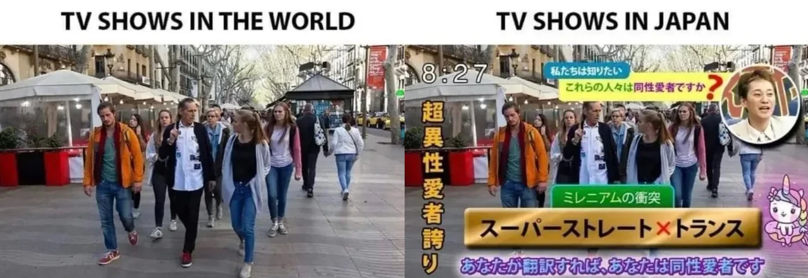

In this note, I will outline how I learn Japanese and which resources I typically use. To put it shortly, what I do on a pretty much daily basis is watch or read Japanese content, say from anime, YouTube, manga, news, etc.. I am not sure what the effective amount is, but personally, about half of what I consume is Japanese (because I am just that much of a weeb). If I encounter a word or grammar that I am not familiar with, I will try to do some research. Afterwards, I will go back to the sentence (where the word/grammar originated) and check to see if what I have learned makes sense. Rinse and repeat and that is basically all I have been doing up till this point. 

Obivously, what I am describing is not new; it falls under what is known as [active immersion](https://tatsumoto-ren.github.io/blog/active-immersion.html). The effectiveness of immersion in comparison to more traditional methods (textbooks, etc..) is a popular (and sometimes toxic) [topic of debate](https://community.wanikani.com/t/can-you-learn-purely-through-immersion/66988) in the Japanese language learning community. I do not claim that whatever I am doing will work for you, but at the very least there may be some ideas you can use.

<!-- more -->

## Background

I will point out that I did not initially plan to study Japanese, but I enjoyed Japanese YouTubers (I was first introduced through translated clips), and there was eventually a need (which translated clips alone could not satisfy) to watch their content and keep up with the latest info. With the limited amount of Japanese I knew at the time and through sheer stubbornness towards wanting to be part of the fandom, I would painstakingly try to translate and understand videos, tweets, comments, etc.. myself. Without realizing, it became a routine which I'd spend hours each day doing and my Japanese got better just as a byproduct; after all, the main goal was just trying to be part of the fandom.

I guess what I am trying to say is that it might be helpful to think about *why* you want to be able to understand Japanese and focus on that as a goal so that you are only using Japanese as a means to an end. It is important that whatever goal you choose should **absolutely** require knowing Japanese to be achieved; something like "I want to be able to enjoy anime" is not ideal since you could always default to using translations.

Obviously, this "workflow" will require you to know a bit of Japanese beforehand. At a minimum, you should aim towards already knowing about 30-40% of the vocabulary / grammar you will encounter for this to work without friction; in terms of JLPT levels, this probably amounts to somewhere between N4 and N3. The idea is : you want to be able to get to a point where you can, on your own, be able to at least understand the main plot of whatever it is you are watching or reading so that there is some form of enjoyment to be gained from the process; I just arbitrarily decided that knowing about 30-40% of the content should be enough for this task. You can refer to some of the excellent guides I showcased in [an earlier note](japaneseguide.md) to help you get started to reaching this point. 

## What do I watch / read?

### YouTube

I recommend watching videos with hard-coded subs; of which there is no shortage of

<figure markdown="span">
  { width="600" }
</figure>

I primarily watch VTubers, アニメコント, and ボイス漫画. These types of content will most probably come with hard-coded subs.

#### VTubers

I usually watch VTubers from [nijisanji](https://www.nijisanji.jp/en) in particular, stuff from their [main channel](https://www.youtube.com/@nijisanji), [ChroNoiR](https://www.youtube.com/@ChroNoiR), [ROF-MAO](https://www.youtube.com/@ROFMAO), and [seitokai](https://www.youtube.com/@seitokai_07), which primarily hosts game-show type content with the VTubers using their 3D models. Having the content be structured also makes it easier to follow along.

Besides nijisanji, I also watch :

- [mafumafu](https://www.youtube.com/@uni_mafumafu) (his [立ち絵動画](https://www.youtube.com/watch?v=rsOuQEiLvG8&list=PLLkGVD9RIO_Cou1S-cNdwBhMfS6nf8QPp) and [変な動画](https://www.youtube.com/watch?v=3CifglC9FtA&list=PLLkGVD9RIO_AVZgiJ5Yjr5qLLA574Inf7) playlists in particular)
- [soraru](https://www.youtube.com/@SorarunoKakurega)
- [amatsuki](https://www.youtube.com/@amatsuki_YHch)
- [ado](https://www.youtube.com/@ado-sense)
- [sutopuri](https://www.youtube.com/@StrawberryPrince)
- [atatakakunaru](https://www.youtube.com/@atatakakunaru) ([takao shinji](https://www.youtube.com/@takaosub) in particular)
- [kokubibi](https://www.youtube.com/@kkvv.)

I also watch clips from these VTubers. They are much shorter compared to videos/streams, and are edited to include subs. Sometimes the clips include animations and drawings which make them fun to watch. Below are some clip channels I often frequent :

- [朝と海](https://www.youtube.com/@asaandumi)
- [kage](https://www.youtube.com/@kage0123)
- [くじくじ](https://www.youtube.com/@%E3%81%8F%E3%81%98%E3%81%8F%E3%81%98)
- [そらまふ大好きチャネル](https://www.youtube.com/@soramafu-BIGSUKI)
- [yeejya](https://www.youtube.com/@yeejyaaaa)
- [ねむねむにゃんこ | nemu-nemu-nyanko](https://www.youtube.com/@sleepysleepynya)

!!! note

    You can find more VTuber (or anyone else really) clips by using `「VTuber」+ 切り抜き / 文字起こし / 手書き` as a search term on YouTube.  

#### アニメコント

The コント in アニメコント comes from the french word *conte* which translates to "tale" (as in story, fable, etc..) in English. アニメコント is therefore "animated tales", and it is a popular video genre in Japan. The western equivalent to アニメコント would probably be something like "animated skits" (think videos/shorts by [Plan3](https://www.youtube.com/@Plan3), etc..) which is also very popular. Anyways, these videos are not only good because of their short length and inclusion of subtitles, but also because they are genuinely funny. Here are some of the ones I regularly watch :

- [私立パラの丸高校](https://www.youtube.com/@parako)
- [マリマリマリー](https://www.youtube.com/@marymarymary80s)
- [くつずれデイズ](https://www.youtube.com/@Kutsuzure_Days)
- [たすくこま](https://www.youtube.com/@komatasuku)
- [オムオムアニメ【コント】](https://www.youtube.com/@omuomu_anime)
- [ピュティフィ](https://www.youtube.com/@pyutifi)
- [いくとん](https://www.youtube.com/@ikuton_1111)

These ones are more long-form and story (as opposed to gag) oriented, but also very good :

- [テイコウペンギン](https://www.youtube.com/@teipen.official)
- [混血のカレコレ](https://www.youtube.com/@karekoreya)
- [ハンドレッドノート / HUNDRED NOTE【公式】](https://www.youtube.com/@HundredNote-Official)
- [【アニメ】あたしンち公式チャンネル](https://www.youtube.com/@Atashinchi)

#### ボイス漫画

As the name suggests, ボイス漫画 are just dubs of mangas. While some are fan-made, most are made by the publishers themselves and are free to access on their YouTube channels. For example, JUMP! and Kadokawa will sometimes post ボイス漫画 on their channels. Here are some good sources :

- [ジャンプチャンネル](https://www.youtube.com/@jumpchannel)
- [キトラ【KADOKAWAキトラ公式ボイストゥーン】](https://www.youtube.com/@kadokawa6694)
- [KADOKAWAanime](https://www.youtube.com/@KADOKAWAanime)
- [コミックエッセイ劇場【公式】](https://www.youtube.com/@KADOKAWAcomicessay)
- [双葉社公式コミックチャンネル](https://www.youtube.com/@futabashacomic)
- [エースこみっくチャンネル](https://www.youtube.com/@AceC_youtube)
- [コミックブリーゼチャンネル【公式】](https://www.youtube.com/@comic_brise)
- [BKレーベル公式【ラノベボイスコミックチャンネル】](https://www.youtube.com/@BKcomics_channel)
- [【公式】PASH!  コミックス・ブックス・文庫](https://www.youtube.com/@pashup8195/videos)

ボイス漫画 doesn't necessarily have to be based on an actual published manga, if someone wants to make content or tell a story with that style then they are free to do so, and this is exactly what [FermiLab](https://www.youtube.com/@ferumi) (also check out [here](https://www.youtube.com/@rin_lab) and [here](https://www.youtube.com/@fermi_lab)) did to create educational videos. 

#### Misc

This is just a place for YouTube content that doesn't really fit into the previous three categories :

- Table top role playing games (TRPGs). In particular, [Call of Cthulu](https://www.chaosium.com/call-of-cthulhu-rpg/) is popular in Japan and is a source of a lot of fun content (check out [あそびいと](https://www.youtube.com/@asobeat_TRPG) and [まにむ](https://www.youtube.com/@manimu_)).

!!! note

    I have been intentionally excluding BL content thus far (I am a fudanshi). This is because I kind of want all the BL content to be in a separate note, and its probably better that way anyway since for some reason there is SOOO much BL content available so it would have just taken up a lot of space if I were to list them here. Whenever I am finished writing the BL note, I will include a link here so you can check it out if so inclined.

<!-- 
https://www.youtube.com/@comicgene_ch
-->

### Anime

### Manga
